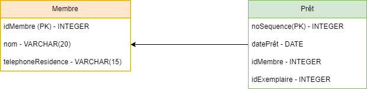

## Exercices

Pour les estimations prenez les valeurs du tbaleu ci-dessous (Tableau 1) pour les paramètres du disque. Soit le schéma relationnel suivant :

Tableau 1 Paramètres des disques
|Paramètre|Signification|
|:----|:----|
|TempsESDisque(n)|Temps de transfert total (lecture ou écriture) de n octets du disque|
|TempsTrans(n)|Temps de transfert des n octets sans repositionnement|
|TempsPosDébut|Temps de positionnement au premier octet à transférer (ex : 10 ms)|
|TempsRotation|Délai de rotation (ex : 4 ms)|
|TempsDépBras|Temps de déplacement du bras (ex : 6 ms)|
|TauxTransVrac|Taux de transfert en vrac (ex : 40Mo/sec)|
|TempsESBloc|Temps de transfert d'un bloc (ex : 11 ms)|
|TempsTrans|Temps de transfert d'un bloc sans repositionnement (ex : 0,1 ms)|
|TailleBloc|Taille d'un bloc (ex : 4ko octets)|

La base de données est composé de deux tables (Prêt et Membre) ayant les caractèristiques suivantes :


Figure1. Structure des tables Membre et Prêt.



Tableau 2. Statistiques pour une représentation sérielle de la table Prêt.
|N<sub>Prêt</sub>|525 000|
|:----|:----|
|FBM<sub>Prêt</sub>|80|
|Card<sub>Prêt</sub>(idMembre)|10 000|
|Ordre<sub>I</sub>|100|

Tableau 3. Statistiques pour une représentation sérielle de la table Membre.
|NMembre|10 000|
|:----|:----|
|FBM<sub>Membre</sub>|80|
|Card<sub>Membre</sub>(idMembre)|10 000|
|Ordre<sub>I</sub>|100|


Pour chacune des questions suivantes, vous devez estimer le temps de calcul théorique et le temps de calcul réel afin de les comparer. Supposons pour la suite qu'il s'agit d'une organisation sérielle pour la table Prêt. Estimez le nombre de blocs nécessaires pour les données en supposant qu'il n'y ait aucune fragmentation interne.


Question 1) 
```
Estimez le temps nécessaire à un balayage de la table en supposant un seul positionnement du bras de lecture/écriture.
```

Question 2) 
```
En supposant que le nombre maximal de blocs pouvant être lus sans interruption est 20, estimez le temps nécessaire à un balayage.
```

Question 3) 
```
Estimez le temps d'une sélection par égalité (S=IP) sur le idMembre avec un index primaire arbre-B+ sur le idMembre. Supposez que le facteur de blocage dans les feuilles de l'index primaire est 2/3 du facteur de blocage de la représentation sérielle. Supposez que les prêts sont distribués uniformément entre les membres. L'ordre maximal de l'index est estimé à 100.
```

Question 4) 
```
Estimez la taille de l'index précédent en nombre de blocs.
```

Question 5) 
```
Estimez le temps d'une sélection par égalité (S=IS) sur le idMembre avec un index secondaire arbre-B+ sur le idMembre en ne tenant par compte de l'optimisation qui consiste à éviter la relecture des blocs de données. L'ordre maximal est estimé à 100.
N.B. Le nombre de blocs au niveau des feuilles (FI) peut être estimé par le nombre de tuples divisé par l'ordre moyen de l'index (estimé à 2/3 de l'ordre maximal).
```

Question 6) 
```
Estimez le temps nécessaire pour effectuer la jointure Prêt-Membre par l’algorithme des boucles imbriquées multi-blocs (BIM). Produisez deux estimations, l'une avec Prêt comme table externe et l'autre avec Membre comme table externe. La taille d’espace mémoire centrale disponible en nombre de blocs est estimée à 50.
```

Question 7) 
```
Estimez le temps nécessaire pour effectuer la même jointure par la boucle imbriquée avec index (BII) en utilisant un index primaire sur l’attribut de jointure (idMembre) pour la table Prêt.
```

Question 8) 
```
Même question qu’en 7) en utilisant un index secondaire sur l’attribut de jointure (idMembre) pour la table Prêt. Supposez que l’optimisation qui consiste à éviter la lecture des blocs pour l’accès par index est utilisée pour la sélection par l’index.
```

Question 9) 
```
Même question qu’en 7) en utilisant un index primaire sur l’attribut de jointure (idMembre) pour la table Membre. L'ordre maximal est estimé à 100.
```

Question 10) 
```
Même question qu’en 9) en utilisant un index secondaire sur l’attribut de jointure (idMembre) pour la table Membre. Supposez que l’optimisation qui consiste à éviter la lecture des blocs pour l’accès par index est utilisée pour la sélection par l’index. L'ordre maximal est estimé à 100.
```


